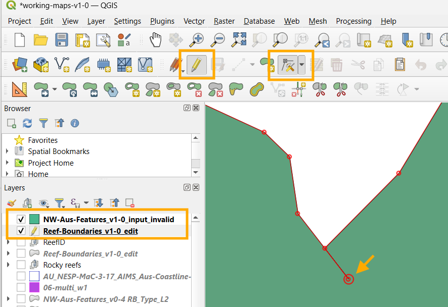

# North and West Australia Reef Features - GIS Dataset
This repository contains utility scripts that were used in the development of the North and West Australia Reef Features dataset. For full information about this dataset see: 

Lawrey, E., Bycroft, R., & Markey, K. (2025). North and West Australian Tropical Reef Features - Boundaries of coral reefs, rocky reefs and sand banks (NESP-MaC 3.17, AIMS, Aerial Architecture) (Version 1-0) [Data set]. eAtlas. https://doi.org/10.26274/XJ4V-2739


It should be noted that this dataset was largely created manually and these scripts represent utilities that were used to process portions of the dataset production, and do not fully represent the full workflow associated with the dataset as much of the processing was performed in QGIS. It should also be noted that most of these scripts refer to files that were intermediate files during the production and thus will not work directly from the public files. They are provided as a form of documentation, rather than to allow a blind rerun of the processing from scratch.

# Version summaries
This provides a brief overview of each version of the dataset. A detailed log of changes made are provided in the [CHANGELOG.md](CHANGELOG.md).

## v1-0 - All depth classification complete - Satellite only reef mapping
This version primarily focused on the completion of assigning depth classifications to all reefs, based on satellite depth estimates using the infrared, red and green channels. These depth estimates are fairly crude, but are relatively consistent across the whole study area. In the next version of the dataset we will be calibrating and assessing the accuracy of the depth classifications based on a comparison with the AHO marine charts.

This version of the dataset is a mapping of all the reefs based primarily from satellite imagery alone. We have not yet incorporated the additional information that is available from bathymetry datasets and marine charts into this version, other than determining where reefs were previously mapped.

## v0-4 - Developed for the draft national scale NVCL 
This version is intended to flow into the national scale reef dataset (Lawrey & Bycroft, 2025). This national scale dataset is intended to be classified to the Natural Values Common Language and will combine updated mapping of the GBR and Torres Strait, and existing mapping of the Coral Sea. In this version we drop the integration of the 'Shallow sediment' and the automated 'Intertidal Rocky Reef' datasets. Each of these need additional work to make them align with the NVCL definitions. We shift this integration to the national scale, so these feature types are treated uniformly at the national scale.

Lawrey, E., Bycroft, R. (2025). Australian Tropical Reef Features - Boundaries of coral and rocky reefs (NESP MaC 3.17, AIMS). [Data set]. eAtlas. https://doi.org/10.26274/4rrw-rr88

This version introduced the following classifications:
- `Coral Reef Inner Flat` classification to represent low ecologically active areas on reefs.
- `Limestone reef` and `Sandy Limestone Pavement` to better represent the limestone reefs around the Pilbara. 

This version includes the following improvements:
- The mapping of the paleo rocky reefs off Eighty mile beach, separating out sand banks from the rocky portions.
- Review and improvement of the 'Attachment' attribute. This found 6% error rate, with remnant errors estimated at 2%.
- Significant improvement to the mapping Cocos Keeling Island, Christmas Island, Norfolk Island, Middleton Reef, Elizabeth Reef, and Lord Howe Island.

### Known issues
- The `EdgeAcc_m` attribute is a string field when it should be a numeric field. Some features (~5%) do not have their edge accuracy assessed.
- The `DepthCat` and `DepthCatSr` is not assigned for most features, however most offshore features were assessed to allow their assignment to shallow or deep.
- Only limited review has been performed on the expert assessment of the `FeatConf` and `TypeConf`.  
- Many of the small inshore rocky reefs are not included, particularly in the Kimberley area. It was decided to defer the inclusion of the automated intertidal rocky reef mapping as it needs more work.
- The classification accuracy of the reefs in the Pilbara needs more work. This region has a lot of limestone reefs, with an overlay of active modern coral reefs. The division between coral reefs and limestone reefs has only been partly implemented.
- The `Coral Reef Inner Flat` has not been fully rolled out to the fringing reefs of Kimberley. As a result most of the fringing reefs only cover the active coral area, not the reef flat. As a result this version underestimates geological extent of the reefs.

## v0-3 - UQ Habitat classification masks
This version was developed to assist with the UQ habitat mapping. It consisted of the coral reefs, rocky reefs and shallow sediment. The rocky reefs included both the manually digitised rocky reefs and semi-automated intertidal rocky reef boundary (AU_NESP-MaC-3-17_AIMS_Rocky-reefs_V1) combined. The shallow sediment corresponded to optically shallow areas mapped to approximately LAT, except for seagrass areas where deeper waters were included. The training of the habitat mapping was split into coral reef, rocky reef and sediment areas based on these layers.

No additional validation was done on this version, above the review conducted as part of `v0-2`.

# Setup guide for running the scripts and editing the data
Most of the mapping in this dataset is perform manually in QGIS based on satellite imagery. The scripts are used to download the source data, and to perform transformations on the classification and clipping operations. 

## 1. Prerequisites
- If using Conda, install [Miniconda](https://www.anaconda.com/docs/getting-started/miniconda/install) (Untested) or use Anaconda Navigator.

## 2. Clone the Repository
```bash
git clone https://github.com/eatlas/AU_NESP-MaC-3-17_AIMS_NW-Aus-Features
cd AU_NESP-MaC-3-17_AIMS_NW-Aus-Features
```

## 3. Using Conda 

1. Create the Conda environment. This step can take 10 min. If you are using Anaconda open the default Anaconda Prompt, change to the project directory 
    ```bash
    cd {path to the AU_NESP-MaC-3-17_AIMS_NW-Aus-Features dataset} 
    conda env create -f environment.yml
    ```
2. Activate the environment
    ```bash
    conda activate nw-aus-feat-env
    ```

## 4. Editing in QGIS
If you are making a new version of the dataset then you should start with the previous 'edit' version, not the final processed version. 
### v0-4 processing notes
For v0-4 we needed to adjust the classification so `09-v0-4-class-cross-walk.py` was used to read `working/02/Reef_Boundaries_Clean.shp`, the previous editable version of the dataset. `v0-3` release didn't have an editable version because it focused on merging datasets together. This script created saved the conversion to `working/09/Reef-Boundaries_v0-4.shp`, which was manually copied to `data/v0-4/in/Reef-Boundaries_v0-4_edit.shp`. This manual copy was done to prevent an accidental overwrite of any manual edits if the script was run once again. `data/v0-4/in/Reef-Boundaries_v0-4_edit.shp` was then manually edited in QGIS to fix issues in the previous version. This shapefile is the current editable version. The final data file `data/v0-4/out/NW-Aus-Features_v0-4.shp` is derived from the edit version, by running `10-v0-4-clip-land.py`.

### v1-0 process notes
We started with copying over the `data/v0-4/` to `data/v1-0`. We updated the paths in the QGIS files to fix path dependencies. We then made edits to the `Reef-Boundaries_v1-0_edit.shp` dataset, recording progress in the `CHANGELOG.md`. The final output products were made using `10-clip-land.py`, `11-expand-attribs.py` and `12-make-RB_Type_L2.py`. Analysis of the changes were done using `A02-unmapped-reefs.py`, `A02b-tier1-overlap-analysis.py` and `A03-version-changes.py`. 

If you were to start from scratch from this version then you would download the repo, run 01a, 01b, 01c, then remake the outputs by running scripts 10, 11, and 12. Scripts 02, 03, 04, 05, 06, 07, 08, and 09 are only relevant to earlier datasets and are provided as documentation of the history of the processing.


## Moving the 3rd party data download out of One Drive using a Symbolic link (Windows)

The development of this dataset and the production of the preview maps relies on a bunch of third party datasets. These are large files and so you may wish for them to be downloaded to a separate location to the default used in this repository. For example you may want to work on this dataset in Teams or on One Drive, but not have the third party data saved in these locations. 

To prevent the QGIS links and code files from breaking we used a fixed location for the third party data, `data\{version}\in-3p\`. By default the data download will save all third party data to this folder and all other files will expect to find the datasets with that root path. To move the data outside this location use a directory symbolic link.

For this we use a symbolic link, rather than a junction because using a junction will cause OneDrive to sync the linked content.

1. Open a command prompt with administrator privileges.
Click Start, type `cmd`, select Run as administrator. You’ll get the UAC prompt.
2. Using a windows command prompt make sure you are in the data folder of the project
```batch
cd <path to project>\AU_NESP-MaC-3-17_AIMS_NW-Aus-Features\data\v1-0
```
3. Create the symbolic link to where the data is stored. You probably need to ensure this folder exists first (untested)
```batch
mklink /D "in-3p" "C:\data-3p\AU_NESP-MaC-3-17_AIMS_NW-Aus-Features\in-3p"
```

If you can't setup a symbolic link and still want to store the data in a separate folder then you can simply edit the paths in scripts and the paths in the QGIS preview-maps.qgz.

### Removing the link

Deleting the link does **not** delete the data: `rmdir in-3p`. Only the symbolic link is removed.

## Debug:
ERROR conda.core.link:_execute(938): An error occurred while installing package 'conda-forge::libjpeg-turbo-3.0.0-hcfcfb64_1'.
Rolling back transaction: done

[Errno 13] Permission denied: 'C:\\Users\\elawrey\\Anaconda3\\pkgs\\libjpeg-turbo-3.0.0-hcfcfb64_1\\Library\\bin\\wrjpgcom.exe'
()

For some reason this particular cache of the library was set with administrator permissions, preventing conda for using this library in the setup. The fix is to switch to admin permissions, delete the `C:\\Users\\elawrey\\Anaconda3\\pkgs\\libjpeg-turbo-3.0.0-hcfcfb64_1` folder, which is safe since it is just a cache. 

I found that when this failure occurs the resulting conda environment ends up in a corrupted state and it must be manually removed, prior to recreating the environment.

In my case I needed to delete `C:\Users\elawrey\Anaconda3\envs\nw-aus-feat-env`

# Description of scripts

- **`01-download-input-data.py`**
This script downloads the third party datasets used in the preview maps, such as the world land area, the GBR reefs, the Coral Sea vegetation and bathymetry datasets. This script downloads the data directly from the original source data services and stores it in `C:\Data\2025\AU_NESP-MaC-3-17_AIMS_NW-Aus-Features\working`. This is the folder where the QGIS `preview-maps.qgz` will look for the data files. If you download to a different location you will need to adjust the paths in QGIS. This script should download all data files used to recreate the preview maps and plots used for reporting purposes. 
`data_downloader.py` is a utility library that is used by `01-download-preview-map-data.py`.

- **`01a-download-sentinel2.py`**
Downloads Sentinel-2 satellite imagery composites (15th percentile and low tide imagery) for northern Australia and the Great Barrier Reef.

- **`02-v0-3-clean-overlaps.py`**
Removes overlaps between different reef types according to specific hierarchy rules, particularly focusing on High Intertidal Coral Reef features.

- **`03-v0-3-class-cross-walk.py`**
Transforms the RB_Type_L3 classification to a new, refactored classification system with additional attribute fields.

- **`04-v0-3-merge-rocky-reefs.py`**
Merges semi-automated intertidal rocky reef polygons into the main dataset, dissolving only where they touch existing rocky reef features.

- **`05-v0-3-clip-rocks-from-reefs.py`**
Removes overlap between Rocky Reef polygons and other feature types by clipping underlying polygons.

- **`06-v0-3-correct-shallow-mask.py`**
Applies manual corrections to the semi-automated Shallow Marine Mask by adding missed areas and removing false positives.

- **`07-v0-3-clip-merge-shallow-sed.py`**
Creates shallow sediment features from areas in the Shallow-mask not covered by existing reef features and adds them to the dataset.

- **`08-v0-3-clip-land.py`**
Clips the reef features dataset against the Australian coastline to remove any portions that overlap with land.

- **`09-v0-4-class-cross-walk.py`**
This applies an updated `RB_Type_L3` that factors out `Attachment` and `DepthCat` from the RB_Type_L3 classifications. This also detects and corrects any incorrect winding of the polygons. Manual edits were then applied to the output of this script.

- **`10-clip-land.py`**
This script clips the Reef_boundaries_{current version}_edit to the coastline.

- **`11-expand-attribs.py`**
Adds external classification scheme fields (e.g. NVCL, Seamap, Wetlands) to the edited features via a crosswalk and recalculates area and EdgeAcc_m types, outputting a harmonised publication-ready shapefile. This script creates the final output dataset `full-classes/AU_NESP-MaC-3-17_AIMS_NW-Aus-Features_L3_v1-0.shp`.

- **`12-make-RB_Type_L2.py`**
Dissolves full RB_TYPE_L3 classified version of the dataset features to RB_Type_L2 extents, aggregating L3 attributes and deriving representative Attachment, DepthCat, confidence, and edge accuracy metrics per dissolved reef polygon. This dataset is useful for counting reefs, or understanding the full extent of reefs as 'Coral Reef Flats' are dissolved with touching 'Coral Reefs'. This script creates the final output dataset `simp-classes/AU_NESP-MaC-3-17_AIMS_NW-Aus-Features_L2_v1-0.shp`

- **`V01-v0-4-generate-validation-locations.py`**
Validation: Generates stratified multi-batch validation datasets (centroids, simplified extents, boundary-error points, plus fake locations) for multiple validators across 12 regions.

- **`V02-v0-4-combine-validation-batches.py`**
Validation: Merges per-batch validation shapefiles for each validator, reindexes ValidID values, and filters boundary-error points to features marked as existing.

- **`V03-v0-4-assess-boundary-error.py`**
Validation: Computes positional boundary error statistics by comparing validation boundary points to multiple historical/version reef datasets and summarising geodetic distance distributions by region.

- **`V04a-v0-4-assess-edgeacc.py`**
Validation: Samples v0-4 reef perimeters and measures nearest distances to an independent legacy reef/shallow mask to evaluate EdgeAcc_m performance versus empirical boundary error percentiles.

- **`V04b-v0-4-analyse-match-lines.py`**
Validation: Aggregates sampled match-line distances per reef to derive full boundary error percentile distributions and metrics (EdgePerc, EdgeTo50p) for modelling edge uncertainty.

- **`V04c-v0-4-test-monte-carlo-boundary.py`**
Validation: Generates simulated (dithered) reef boundaries via stochastic buffering using EdgeAcc_m-derived log-normal ratios to test Monte Carlo boundary uncertainty modelling.

- **`A01-uncharted-reefs.py`**
Analysis: Identifies coral and rocky reef features within AHO uncharted areas that are not present in AHO reef or ReefKIM datasets to flag potentially uncharted reefs. This analysis is currently limited to the Gulf of Carpentaria.

- **`A02-unmapped-reefs.py`**
This script determines which reef features in the North and West Australian Tropical Reef Features dataset were previously mapped by existing spatial datasets, and which are newly mapped. 

- **`A02b-tier1-overlap-analysis.py`**
This script apportions the contribution each reference dataset (Tier 1 automated and Tier 2 manual) makes to the total number of reefs that were previously known.

- **`A03-version-changes.py`**
This script compares the current version with the previous version to generate statistics about what has changed. This is to help create a detailed change description for the dataset metadata. 

- **`20d-compare-reef-masks.py` - Unused**
Compares manual and automated reef masks to evaluate true positives, false positives, and false negatives.

## Notes on making a new version of this dataset
From time to time this dataset will be improved, making a new version of the dataset. The following are notes on what is needed to be setup when making a new version. Note: This list is not exhaustive and was written mid-way through the development of v1-0 and so is not tested end-to-end.
1. Make sure that you have downloaded `data/{current version}` by running `01a-download-input-data.py`. 
1. Make sure there is a release and tag in GitHub for the current version before you start modifying the code. We might have forgotten to set this up during the previous publication.
2. Rename `data/{current version}` to `data/{new version}`. 
3. Update the version number in `data/in/Reef-Boundaries_{version}_edit.shp`. This will now be the file that we edit to make the new version of the dataset.
4. Rename `data/{new version}/*-{current version}.qgz` to have the new version number. Open each of these in QGIS and update the broken links to the change in the version number.
5. Edit `config.ini` and change the `version` and `in_3p_path` to match the new version.
6. Create a new entry in CHANGELOG.md to record a summary of all the modifications for this version.
7. Run `10-clip-land.py`, `11-expand-attribs.py` and `12-make-RB_Type_L2.py` to determine whether the pipeline works before making changes to the dataset.

### Errors and problems
The following errors and problems can occur when making a new version of the dataset.

#### Running `10-clip-land.py`: ValueError: Input GeoDataFrame contains 1 invalid geometries.
This indicates that one of the adjusted features has a cross over in its polygons. Open the input_invalid shapefile in QGIS to determine the problem location.


## Validation sampling

This analysis was performed on the v0-4 dataset and is planned to be completed as part of the final dataset validation in v1-1. No additional work was done on this in v1-0.

To provide a basic level of validation to the dataset we perform an expert review of a random sample of reef features, looking to answer the following key questions:
1. Does the indicated feature exists? i.e. it is a reef or sand bank
2. Is the classification accurate?
3. Are there other errors associated with the feature such as boundary accuracy or other attributes?
The goal of this validation is to assess the number of false positives that are likely in the dataset. False positives are problematic as they could lead to proponents being sent to investigate non-existent features, leading to wasted time and money.

A significant challenge in validating the dataset is the small size of reefs relative to open water. Simply uninformed random sampling will result in over 99% samples of open water as the reef areas only represent 1.2% of the study area.

We instead assess the accuracy of mapped reefs by randomly selecting a number of reefs to perform a detailed review by two reef mapping experts. This ensures that the focus is on the small areas represented by the reefs. This approach does not assess the false negative rate, i.e. features that are not mapped. 

The density of reef features is not uniform along the coastline, with the Kimberley containing a much higher density of features per unit area. To ensure that each region receives sufficient features to review the study area was broken into 12 regions, each corresponding to segments of 350 - 600 km of coastline. Where possible the boundaries were chose to closely align with existing named regions and with the natural boundaries of systems. All offshore reefs were clustered into a single group due to the low number of offshore features.

A Python script was used to randomly choose an equal number of features from each region. These were organised into batches of 10 features per region per batch. This allowed the team to work progressively, with each batch covering the full study area. 


Each feature to be reviewed is referenced by a point that exists close to the centroid of the feature being reviewed. The point is guaranteed to be inside the polygon. Each reviewer assigns the usual feature classifications, along with an indication of whether the feature is a false positive. This assignment of classifications is performed blind, without review of the existing assigned values. This allows a less biased assessment. 
1. Is there a feature of significance at the location indicated by the polygon (rocky reef, coral reef, sand bank)? (FeatExists)
2. What is an appropriate level of confidence in the feature existence (TypeConf)
3. What is the classification of the feature, without knowing what the original classification? (RB_Type_L3)
4. What is an appropriate level of uncertainty in the classification? (FeatConf)
5. Is the feature fringing, isolated or on an atoll (off the continental shelf), (Attachment)

This script generates locations for validation of the reef features in this dataset.
This is done by dividing the study area into 12 regions as specified by the 
data/v0-4/in/NW-Aus-Features-validation-regions.shp file. Each of the reef features,
as specified in data/v0-4/out/NW-Aus-Features_v0-4.shp, is then assigned to one of these
regions based on the centroid of the feature's geometry. 

The goal is to create a validation dataset that can be reused and applied to updated
versions of the reef features dataset, without needing to reevaluate the mapped features.
The evaluation can be performed automatically by a validation script by comparing the
validation attributes with the mapped features, and comparing the distance between 
the mapped feature and the boundary validation point.

To facilitate the automated validation the validation needs to be divided into three parts:
1. Feature-centroid: A feature centroid point that represents the feature and its attributes. 
This can be linked back to the mapped feature using a spatial join. This point must be 
central and inside the feature polygon to ensure this spatial join works correctly.
2. Polygon-extent: A simplified polygon that represents the extent of the feature. This 
polygon aims to assist the validator in understanding the extent of the feature without 
biasing them to the exact geometry of the feature. The geometry vertices should be randomly 
fuzzed by approximately 50 m and simplified to a approximately 50 m allowable error.
3. Boundary-error: One or more points that line on a random point of the the boundary of the feature polygon. 
These points will be repositioned by the validator to lie on the closest best estimate of the 
true boundary of the feature. To reduce bias, these points should be randomly
chosen from the simplified version of the polygon. These points can lie on the lines
between vertices of the simplified polygon, or the vertices themselves.. 

The Feature-centroid, Polygon-extent and Boundary-error should be cross linked by a unique ID.

The Feature-centroid should have the following attributes:
- ValidID (Integer): Unique identifier for the validation feature. Used to cross-link between the
    centroid, extent and boundary-error features.
- FeatExists (String, values: 'True','False') 
    Is there a feature of significance at the location indicated by the polygon 
    (rocky reef, coral reef, sand bank)?
- TypeConf (String, values: 'High','Medium','Low','Very Low'): 
    What is an appropriate level of confidence in the feature existence (TypeConf)
- RB_Type_L3 (String, values: 
    Coral Reef
    Deep Bank Coral Reef
    Coral Reef Inner Flat
    High Intertidal Coral Reef
    High Intertidal Sediment Reef
    Stromatolite Reef
    Rocky Reef
    Sandy Limestone Pavement
    Limestone Reef
    Low Relief Rocky Reef
    Paleo Coast Rocky Reef
    Intertidal Sediment
    Sand Bank
    Atoll Lagoon Patch Coral Reef
    Atoll Lagoon Coral Reef
    Atoll Rim Coral Reef
    Atoll Flow Coral Reef
    Atoll Platform Coral Reef
    Vegetated Cay
    Unvegetated Cay
    Island
    Mainland
    Seagrass on Coral Reef
    Seagrass on Sediment
    Oceanic vegetated sediments
    Atoll Platform
    Man Made
    Unknown)
    What is the classification of the feature, without knowing what the original classification?
- FeatConf (String, Values: High, Medium, Low, Very Low):
    What is an appropriate level of uncertainty in the classification? (FeatConf)
- Attachment (String, values: 
    Fringing
    Isolated
    Atoll)
Is the feature fringing, isolated or on an atoll (off the continental shelf), (Attachment)

The Polygon-extent should have the following attributes:
- ValidID (Integer): Cross-link back to the matching Feature-centroid.

The Boundary-error should have the following attributes:
- ValidID (Integer): Cross-link back to the matching Feature-centroid.

The script should save the generated validation shapefiles to
working/20/NW-Aus-Features-v0-4_Feature-centroid-{zero padded Batch number}.shp
working/20/NW-Aus-Features-v0-4_Polygon-extent-{zero padded Batch number}.shp
working/20/NW-Aus-Features-v0-4_Boundary-error-{zero padded Batch number}.shp

The script should generate 10 batches of validation data, each containing 10 features per region.


# Reference:

Australian Hydrographic Office. (2021a). AHO Electronic Navigation Charts Simplified Series service (ArcGIS ImageServer). Retrieved March 15 2025, from https://amsis-geoscience-au.hub.arcgis.com/datasets/geoscience-au::aho-enc-series/about

Australian Hydrographic Office. (2021b). AHO Chart Series chart service. Retrieved Nov 28 2024, from https://amsis-geoscience-au.hub.arcgis.com/datasets/geoscience-au::aho-chart-series/about

AHO. (n.d.). Electronic Navigation Charts Simplified Series (ArcGIS ImageServer) [Dataset]. Australian Hydrographic Office. Retrieved February 12, 2025, from https://services.hydro.gov.au/site1/rest/services/Basemaps/AHOENCSimplifiedSeries/ImageServer

Bancroft, K.P. (2009). Establishing long-term coral community monitoring sites in the Montebello/Barrow Islands
marine protected areas: Site descriptions and summary analysis of baseline data collected in December 2006.
Marine Science Program Data Report MSPDR9. June 2011. Marine Science Program, Department of Environment and Conservation, Perth, Western Australia, 91p
https://library.dbca.wa.gov.au/static/Journals/080598/080598-09.pdf

Kordi, M. N., Collins, L. B., O’Leary, M., & Stevens, A. (2016). ReefKIM: An integrated geodatabase for sustainable management of the Kimberley Reefs, North West Australia. Ocean & Coastal Management, 119, 234–243. https://doi.org/10.1016/j.ocecoaman.2015.11.004

Lawrey, E. (2025) Semi-automated Shallow Marine Mask for Northern Australia and GBR Derived from Sentinel-2 Imagery (NESP MaC 3.17, AIMS) (Version 1-1) [Data set]. eAtlas. https://doi.org/10.26274/x37r-xk75


