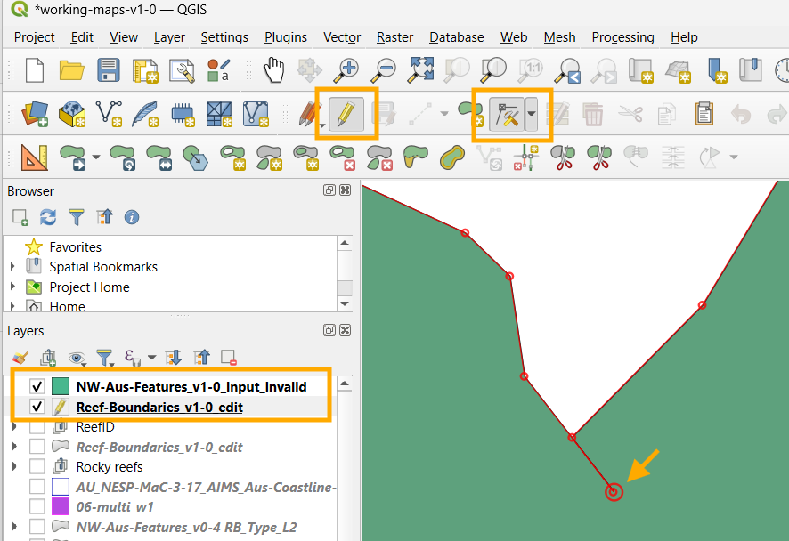

# North and West Australia Reef Features - GIS Dataset
This repository contains utility scripts that were used in the development of the North and West Australia Reef Features dataset. For full information about this dataset see: 

Lawrey, E., Bycroft, R., & Markey, K. (2025). North and West Australian Tropical Reef Features - Boundaries of coral reefs, rocky reefs and sand banks (NESP-MaC 3.17, AIMS, Aerial Architecture) (Version 1-2) [Data set]. eAtlas. https://doi.org/10.26274/XJ4V-2739

# Version summaries
This provides a brief overview of each version of the dataset. A detailed log of changes made is provided in the [CHANGELOG.md](CHANGELOG.md).

## v1-2 - Mapping refinements and NESP MaC Final Report analyses
This version includes an additional 40 sand banks near the Dampier Archipelago and rocky reefs along parts of the northern Kimberley. Further fine-scale digitisation in the northern Kimberley improved the separation of rocky reefs, coral reefs and coral reef flats. Crosswalk adjustments made historical versions more comparable. ReefID allocation was also revised to handle reworked boundaries: when a previous L2 reef component is split into disconnected or reclassified parts, only its greatest-overlap successor inherits its base ID; other parts receive new IDs with their previous IDs recorded for lineage.

Analysis for the final project report added `A04-reef-progression.py` to compare reef counts and areas across versions, `A05-reef-distribution.py` to report countable reefs by analysis region, IMCRA bioregion and marine protected area, and `A06-region-stats-tables.py` to generate the report tables from the regional statistics.

## v1-1 - Permanent ReefIDs
This version focused on assigning permanent unique identifiers to each mapped feature. To ensure IDs were not assigned to false reefs we cleaned up small sliver features created due to the land clipping. This version added the `11-allocate-ReefIDs.py` to manage the ID allocation, and reallocation for new versions of the dataset, copying over previously allocated IDs and assigning new ones as needed.

## v1-0 - All depth classification complete - Satellite only reef mapping
This version primarily focused on the completion of assigning depth classifications to all reefs, based on satellite depth estimates using the infrared, red and green channels. These depth estimates are fairly crude, but are relatively consistent across the whole study area. In the next version of the dataset we will be calibrating and assessing the accuracy of the depth classifications based on a comparison with the AHO marine charts.

This version of the dataset is a mapping of all the reefs based primarily from satellite imagery alone. We have not yet incorporated the additional information that is available from bathymetry datasets and marine charts into this version, other than determining where reefs were previously mapped.

## v0-4 - Developed for the draft national scale NVCL 
This version is intended to flow into the national scale reef dataset (Lawrey & Bycroft, 2025). This national scale dataset is intended to be classified to the Natural Values Common Language and will combine updated mapping of the GBR and Torres Strait, and existing mapping of the Coral Sea. In this version we drop the integration of the 'Shallow sediment' and the automated 'Intertidal Rocky Reef' datasets. Each of these needs additional work to make them align with the NVCL definitions. We shift this integration to the national scale, so these feature types are treated uniformly at the national scale.

Lawrey, E., Bycroft, R. (2025). Australian Tropical Reef Features - Boundaries of coral and rocky reefs (NESP MaC 3.17, AIMS). [Data set]. eAtlas. https://doi.org/10.26274/4rrw-rr88

This version introduced the following classifications:
- `Coral Reef Inner Flat` classification to represent low ecologically active areas on reefs.
- `Limestone Reef` and `Sandy Limestone Pavement` to better represent the limestone reefs around the Pilbara. 

This version includes the following improvements:
- The mapping of the paleo rocky reefs off Eighty mile beach, separating out sand banks from the rocky portions.
- Review and improvement of the 'Attachment' attribute. This found a 6% error rate, with remnant errors estimated at 2%.
- Significant improvements to the mapping of Cocos Keeling Island, Christmas Island, Norfolk Island, Middleton Reef, Elizabeth Reef, and Lord Howe Island.

### Known issues
- The `EdgeAcc_m` attribute is a string field when it should be a numeric field. Some features (~5%) do not have their edge accuracy assessed.
- The `DepthCat` and `DepthCatSr` are not assigned for most features, however most offshore features were assessed to allow their assignment to shallow or deep.
- Only limited review has been performed on the expert assessment of the `FeatConf` and `TypeConf`.  
- Many of the small inshore rocky reefs are not included, particularly in the Kimberley area. It was decided to defer the inclusion of the automated intertidal rocky reef mapping as it needs more work.
- The classification accuracy of the reefs in the Pilbara needs more work. This region has a lot of limestone reefs, with an overlay of active modern coral reefs. The division between coral reefs and limestone reefs has only been partly implemented.
- The `Coral Reef Inner Flat` has not been fully rolled out to the fringing reefs of Kimberley. As a result most of the fringing reefs only cover the active coral area, not the reef flat. As a result this version underestimates the geological extent of the reefs.

## v0-3 - UQ Habitat classification masks
This version was developed to assist with the UQ habitat mapping. It consisted of the coral reefs, rocky reefs and shallow sediment. The rocky reefs included both the manually digitised rocky reefs and semi-automated intertidal rocky reef boundary (AU_NESP-MaC-3-17_AIMS_Rocky-reefs_V1) combined. The shallow sediment corresponded to optically shallow areas mapped to approximately LAT, except for seagrass areas where deeper waters were included. The training of the habitat mapping was split into coral reef, rocky reef and sediment areas based on these layers.

No additional validation was done on this version, above the review conducted as part of `v0-2`.

# Setup guide for running the scripts and editing the data
Most of the mapping in this dataset is performed manually in QGIS based on satellite imagery. The scripts are used to download the source data, and to perform transformations on the classification and clipping operations. 

## 1. Prerequisites
- If using Conda, install [Miniconda](https://www.anaconda.com/docs/getting-started/miniconda/install) (Untested) or use Anaconda Navigator.

## 2. Clone the Repository
```bash
git clone https://github.com/eatlas/AU_NESP-MaC-3-17_AIMS_NW-Aus-Features
cd AU_NESP-MaC-3-17_AIMS_NW-Aus-Features
```

## 3. Using Conda 

1. Create the Conda environment. 
    ```bash
    cd {path to the AU_NESP-MaC-3-17_AIMS_NW-Aus-Features dataset} 
    conda env create -f environment.yml
    ```
2. Activate the environment
    ```bash
    conda activate nw-aus-feat-env
    ```

## 4. Download all the input and output data
Run the following script to download the project files for the version specified in `config.ini` and the configured third-party sources (some optional large bathymetry downloads are disabled in the script):

```bash
python 01a-download-input-data.py
```

Download the satellite imagery. This will take a while as it is over 200 GB of data. See [Moving the 3rd party data download out of One Drive using a Symbolic link (Windows)](#moving-the-3rd-party-data-download-out-of-one-drive-using-a-symbolic-link-windows) if you want to store the data to a non-standard location.
    
```bash
python 01b-download-sentinel2.py
```

Set up the virtual rasters for the satellite imagery. This is so that each mosaic of satellite images can be treated as a layer.

```bash
python 01c-create-virtual-rasters.py
```

## 5. Open in QGIS

Load `NWF1-working-maps-{version}.qgz` into QGIS. This is the file that was used for editing the reef mapping, as well as publication maps. It has references to all the input and output data files and expects all the data relative to its location. In QGIS the `Reef-Boundaries_{version}_edit` layer is the primary source of truth for all modifications to the reef boundaries or classifications. 

## 6. Convert modifications to the output
When all modifications to `Reef-Boundaries_{version}_edit.shp` are complete run:

```bash
python 10-clip-land.py
python 11-allocate-ReefIDs.py
python 12-expand-attribs.py
python 13-make-RB_Type_L2.py
```
This clips the edit polygons against the coastline in `data/{version}/in-3p/AU_AIMS_Coastline_50k_2024/Split/`, carries forward or allocates ReefIDs, uses `data/{version}/in/RB_Type_L3_crosswalk.csv` to add external classifications, and dissolves L3 features to L2 extents. The published shapefiles are saved under `data/{version}/out/full-classes/` (L3) and `data/{version}/out/simp-classes/` (L2).

## 7. Analysis
After producing the L3 and L2 shapefiles, run the analyses needed for the release:
- `A02-unmapped-reefs.py`: first run with `--prepare`, review and tag the templates in QGIS, then run without the flag to estimate how many countable reefs were previously unmapped. Some third-party inputs are currently read from `data/v1-0/in-3p/` regardless of the configured version; keep those files available. See `A02-unmapped-reefs-spec.md`.
- `A02b-tier1-overlap-analysis.py`: assess the contribution of each automated and manually tagged reference source to the previously known reefs; requires the A02 analysis output.
- `A03-version-changes.py`: compare this version with the previous version's edit shapefile by default, or use `--processed` to compare published L3 outputs. Requires both versions' files. See `A03-version-changes-spec.md`.
- `A04-reef-progression.py`: compare reef counts and areas across versions, using a common classification, study region and countable-reef method. Saves tables and figures in `working/{version}/A04/`.
- `A05-reef-distribution.py`: count countable coral and rocky reefs and their areas by Analysis-region, IMCRA meso-scale bioregion and CAPAD 2024 marine protected area. Saves a CSV and regional shapefiles in `data/{version}/out/stats/`, and conservation checks in `working/{version}/A05/region-stats-checks.csv`. See `A05-reef-distribution-spec.md`.
- `A06-region-stats-tables.py`: after A05, generate the L3 feature stocktake, countable-reef, regional and protected-area Markdown report tables in `data/{version}/out/stats/`.

### Interpreting the outputs
L3 shapefiles contain individually mapped feature polygons; the L2 shapefile dissolves touching L3 parts of the same broader reef class into whole-reef extents. The analyses use *countable reefs*: nearby L2 coral or rocky reefs are clustered by type, then clusters with an effective width below 100 m are excluded. Feature counts, L2 polygon counts and countable-reef counts are therefore different measures. A05 assigns counts to regions while splitting reef area across boundaries. CAPAD protected areas can overlap, so counts and areas summed across individual protected areas can include the same reef more than once; inspect the conservation checks when using these results.

### v1-2 processing and QA
For v1-2, set `version = v1-2` and `previous_version = v1-1` in `config.ini`, and check that the current and previous edit, L3 and L2 paths point to the intended files. After QGIS edits, run scripts 10-13 in the order shown above (do not use `--fresh` for v1-2). Review the land-split and ReefID poor-match layers described in [ReefID Workflow](#reefid-workflow), correct unexpected cases in the edit layer and rebuild the outputs. Run A05 and review `working/v1-2/A05/region-stats-checks.csv` for failures or unexpected CAPAD overlap counts before using A06 to prepare report tables. A05 writes warnings for failed conservation checks but does not stop automatically.

If you are making a new version of the dataset then you should start with the previous 'edit' version, not the final processed version. 

### v0-4 processing notes
Historical workflow (not the v1-2 run order): `09-v0-4-class-cross-walk.py` read `working/02/Reef_Boundaries_Clean.shp`, the previous editable dataset. The v0-3 release did not have an editable version because it focused on merging datasets. Script 09 saved `working/09/Reef-Boundaries_v0-4.shp`, which was manually copied to `data/v0-4/in/Reef-Boundaries_v0-4_edit.shp` to protect subsequent QGIS edits from accidental overwrite. The v0-4 final data was derived from that edit version using the then-current land-clipping step.

### v1-0 processing notes
Historical workflow (script numbers changed when ReefID allocation was introduced): we copied `data/v0-4/` to `data/v1-0`, updated the QGIS paths and edited `Reef-Boundaries_v1-0_edit.shp`, recording progress in `CHANGELOG.md`. At that time, the final products were made using scripts 10 (land clipping), 11 (attribute expansion) and 12 (L2 dissolution). Analysis of changes used A02, A02b and A03.

Scripts 02-09 document earlier processing stages and are not part of the current v1-2 output sequence.

### v1-1 processing notes
In preparation for the allocation of permanent identifiers we added the detection in `10-clip-land.py` to identify any of the editing polygons are split into multiple parts during the clipping. This was to ensure that small false reefs near the coastline were not allocated identifiers. Each of the splits were manually reviewed and resolved, except for a very small number of cases. The ID allocation is performed by `11-allocate-ReefIDs.py`. The ID allocation scheme must maintain permanent IDs and so the scripts copy over IDs from previous versions. Since this is the first version to have identifiers we run:
```bash
python 11-allocate-ReefIDs.py --fresh
```
In future versions of the dataset we must ensure that config.ini is set up with the correct current and previous version paths to allow the ID copy to work.

## Moving the 3rd party data download out of One Drive using a Symbolic link (Windows)

The development of this dataset and the production of the preview maps relies on a bunch of third party datasets. These are large files (over 200 GB total) and should not be stored in OneDrive or Teams. Additionally, these datasets are reused across multiple versions of the dataset, so keeping a single shared copy avoids unnecessary duplication.

To prevent the QGIS links and code files from breaking we use a fixed location for the third party data, `data/{version}/in-3p/`. By default the data download (`01a-download-input-data.py`) saves all third party data to this folder. To avoid syncing this data to OneDrive and to share it across versions, we replace the contents of `in-3p` with symbolic links pointing to a shared directory (`C:\data-3p`).

We use symbolic links rather than junctions because junctions cause OneDrive to sync the linked content.

### Setup using U01-setup-symbolic-links.bat

The `U01-setup-symbolic-links.bat` script automates the creation of symbolic links for all expected third party datasets. It links each dataset folder in `data/{version}/in-3p/` to the corresponding folder in `C:\data-3p`.

**First time setup (migrating existing data):**

1. Run `01a-download-input-data.py` to download third party datasets into `data/{version}/in-3p/`.
2. Manually move each dataset folder from `data/{version}/in-3p/` to `C:\data-3p`. For example:
```batch
move "data\v1-0\in-3p\AU_AIMS_Coastline_50k_2024" "C:\data-3p\AU_AIMS_Coastline_50k_2024"
```
3. Open a command prompt as Administrator and run:
```batch
U01-setup-symbolic-links.bat v1-1
```
The script creates symbolic links for any dataset that exists in `C:\data-3p` but is missing from `in-3p`.

**Setting up a new version (e.g. v1-2):**

If datasets are already in `C:\data-3p` from a previous version, simply run:
```batch
U01-setup-symbolic-links.bat v1-2
```
This creates all the symbolic links in the new version's `in-3p` folder without duplicating data.

**Script behaviour:**
- `[LINK]` — dataset found in `C:\data-3p`, symlink created.
- `[SKIP]` — folder already exists in `in-3p` (symlink or real folder), no action taken.
- `[MISS]` — dataset not found in either location. Run `01a-download-input-data.py` first, then move the folder to `C:\data-3p`.

### Manual alternative

If you cannot run the script, you can create individual symbolic links manually in an Administrator command prompt:
```batch
cd <path to project>\AU_NESP-MaC-3-17_AIMS_NW-Aus-Features\data\v1-0\in-3p
mklink /D "AU_AIMS_Coastline_50k_2024" "C:\data-3p\AU_AIMS_Coastline_50k_2024"
```

### Removing a link

Deleting a symbolic link does **not** delete the data: `rmdir AU_AIMS_Coastline_50k_2024`. Only the link is removed, the shared data in `C:\data-3p` is unaffected.

## Debug:
ERROR conda.core.link:_execute(938): An error occurred while installing package 'conda-forge::libjpeg-turbo-3.0.0-hcfcfb64_1'.
Rolling back transaction: done

[Errno 13] Permission denied: 'C:\\Users\\elawrey\\Anaconda3\\pkgs\\libjpeg-turbo-3.0.0-hcfcfb64_1\\Library\\bin\\wrjpgcom.exe'
()

For some reason this particular cache of the library was set with administrator permissions, preventing conda from using this library in the setup. The fix is to switch to admin permissions, delete the `C:\\Users\\elawrey\\Anaconda3\\pkgs\\libjpeg-turbo-3.0.0-hcfcfb64_1` folder, which is safe since it is just a cache. 

I found that when this failure occurs the resulting conda environment ends up in a corrupted state, and it must be manually removed, prior to recreating the environment.

In my case I needed to delete `C:\Users\elawrey\Anaconda3\envs\nw-aus-feat-env`

# Description of scripts

Scripts with a version in their filename, such as `02-v0-3-clean-overlaps.py`, were developed for that specific dataset version. They typically transformed data from the previous version to prepare the next version. They are retained to document the provenance of processing from the earliest versions through to the latest dataset, not as steps to rerun for v1-2. Scripts without a version in their filename apply to v1-0 and later versions.

- **`01a-download-input-data.py`**
This script downloads all the data needed to work on this project (except for the satellite imagery). This includes custom input data and third party datasets used in the publication maps and analysis scripts. This script downloads the data directly from the original source data services. It stores all the data in `data/{version}`, based on the version specified in `config.ini`. 

- **`01b-download-sentinel2.py`**
Downloads Sentinel-2 satellite imagery composites (15th percentile and low tide imagery) for northern Australia and the Great Barrier Reef.

- **`01c-create-virtual-rasters.py`**
Creates GDAL virtual rasters for folders of downloaded Sentinel-2 imagery; requires `gdalbuildvrt` on the PATH.

- **`02-v0-3-clean-overlaps.py`**
Removes overlaps between different reef types according to specific hierarchy rules, particularly focusing on High Intertidal Coral Reef features.

- **`03-v0-3-class-cross-walk.py`**
Transforms the RB_Type_L3 classification to a new, refactored classification system with additional attribute fields.

- **`04-v0-3-merge-rocky-reefs.py`**
Merges semi-automated intertidal rocky reef polygons into the main dataset, dissolving only where they touch existing rocky reef features.

- **`05-v0-3-clip-rocks-from-reefs.py`**
Removes overlap between Rocky Reef polygons and other feature types by clipping underlying polygons.

- **`06-v0-3-correct-shallow-mask.py`**
Applies manual corrections to the semi-automated Shallow Marine Mask by adding missed areas and removing false positives.

- **`07-v0-3-clip-merge-shallow-sed.py`**
Creates shallow sediment features from areas in the Shallow-mask not covered by existing reef features and adds them to the dataset.

- **`08-v0-3-clip-land.py`**
Clips the reef features dataset against the Australian coastline to remove any portions that overlap with land.

- **`09-v0-4-class-cross-walk.py`**
This applies an updated `RB_Type_L3` that factors out `Attachment` and `DepthCat` from the RB_Type_L3 classifications. This also detects and corrects any incorrect winding of the polygons. Manual edits were then applied to the output of this script.

- **`10-clip-land.py`**
This script clips the Reef_boundaries_{current version}_edit to the coastline. After clipping, multipart features are exploded to singleparts. A QA shapefile is produced listing any features that were split into multiple parts by the land clipping.

- **`11-allocate-ReefIDs.py`**
Assigns permanent, globally unique ReefIDs to reef features after land clipping. IDs are allocated at the L2 reef level (the whole geological structure) with alphabetic sub-feature suffixes for multi-component reefs. IDs persist across dataset versions via spatial matching against the previous version. Use `--fresh` for first-time allocation.

- **`12-expand-attribs.py`**
Reads the ReefID-assigned output of script 11, adds external classification scheme fields (e.g. NVCL, Seamap, Wetlands) using the crosswalk, and recalculates area and EdgeAcc_m types. Writes `data/{version}/out/full-classes/AU_NESP-MaC-3-17_AIMS_NW-Aus-Features_L3_{version}.shp`; unmatched classes are written to a QA layer and stop processing.

- **`13-make-RB_Type_L2.py`**
Dissolves the published L3 features into RB_Type_L2 extents, aggregating attributes and retaining the base ReefID for each dissolved reef. This shows the full extent of coral reefs, including touching reef-flat parts. Writes `data/{version}/out/simp-classes/AU_NESP-MaC-3-17_AIMS_NW-Aus-Features_L2_{version}.shp` and a QA layer for mixed Attachment values.

- **`V01-v0-4-generate-validation-locations.py`**
Validation: Generates stratified multi-batch validation datasets (centroids, simplified extents, boundary-error points, plus fake locations) for multiple validators across 12 regions.

- **`V02-v0-4-combine-validation-batches.py`**
Validation: Merges per-batch validation shapefiles for each validator, reindexes ValidID values, and filters boundary-error points to features marked as existing.

- **`V03-v0-4-assess-boundary-error.py`**
Validation: Computes positional boundary error statistics by comparing validation boundary points to multiple historical/version reef datasets and summarising geodetic distance distributions by region.

- **`V04a-v0-4-assess-edgeacc.py`**
Validation: Samples v0-4 reef perimeters and measures nearest distances to an independent legacy reef/shallow mask to evaluate EdgeAcc_m performance versus empirical boundary error percentiles.

- **`V04b-v0-4-analyse-match-lines.py`**
Validation: Aggregates sampled match-line distances per reef to derive full boundary error percentile distributions and metrics (EdgePerc, EdgeTo50p) for modelling edge uncertainty.

- **`V04c-v0-4-test-monte-carlo-boundary.py`**
Validation: Generates simulated (dithered) reef boundaries via stochastic buffering using EdgeAcc_m-derived log-normal ratios to test Monte Carlo boundary uncertainty modelling.

- **`A02-unmapped-reefs.py`**
Builds countable-reef clusters and determines which were previously mapped by reference datasets. Run with `--prepare` to create manual tagging templates, review them in QGIS, then run without the flag for the annotated analysis and Markdown summary.

- **`A02b-tier1-overlap-analysis.py`**
This script apportions the contribution each reference dataset (Tier 1 automated and Tier 2 manual) makes to the total number of reefs that were previously known.

- **`A03-version-changes.py`**
Compares the current and previous edit shapefiles by default, or their processed L3 shapefiles with `--processed`. Writes a Markdown change report for dataset metadata and a verification shapefile.

- **`A04-reef-progression.py`**
Compares reef counts and areas across mapping versions, producing progression tables and figures using a common region, classification and countable-reef method.

- **`A05-reef-distribution.py`**
Counts countable coral and rocky reefs and their areas by analysis region, IMCRA bioregion and CAPAD 2024 marine protected area. Writes regional summaries, map layers and conservation checks.

- **`A06-region-stats-tables.py`**
Generates Markdown report tables for mapped L3 features, countable reefs, regional distributions and protected areas from the L3 dataset and A05 results.

## Notes on making a new version of this dataset
From time to time this dataset will be improved, making a new version of the dataset. The following are notes on what is needed to be set up when making a new version. Note: This list is not exhaustive and was written mid-way through the development of v1-0 and so is not tested end-to-end.
1. Make sure that you have downloaded `data/{current version}` by running `01a-download-input-data.py`. 
2. Make sure there is a release and tag in GitHub for the current version before you start modifying the code. We might have forgotten to set this up during the previous publication.
3. Edit `config.ini` and change the versions in all the current and previous paths.
4. Copy `data/{current version}` to `data/{new version}`.
5. Set up the `in-3p` data. If using symbolic links, move any real dataset folders in the new version's `in-3p` to the shared directory first (checking for existing copies), then run `U01-setup-symbolic-links.bat {new version}` from an administrator Command Prompt. The batch file does not replace existing folders. Activate the Conda environment and run the download for any other required files.
```bash
conda activate nw-aus-feat-env
python 01a-download-input-data.py
```
6. Rename the copied edit shapefile to `data/{new version}/in/Reef-Boundaries_{new version}_edit.shp`. This is the file to edit for the new version.
7. Rename `data/{new version}/*-{current version}.qgz` to have the new version number. Open each of these in QGIS and update the broken links to the change in the version number. Update the layer names for `Reef boundary Edit {version}` to the new current version.
8. Create a new entry in CHANGELOG.md to record a summary of all the modifications for this version.
9. Run `10-clip-land.py`, `11-allocate-ReefIDs.py`, `12-expand-attribs.py` and `13-make-RB_Type_L2.py` to check the pipeline before making changes to the dataset. Use `python 11-allocate-ReefIDs.py --fresh` only if there is no previous version with ReefIDs; otherwise the script matches against the previous version.
10. Once the new version is complete and rebuilt, publish the new data to nextcloud.eatlas.org.au, add a summary of the changes to the changelog of the dataset metadata, update the version number in the citation text, update the DOI version number, publish the new version to eAtlas GeoServer.

### Errors and problems
The following errors and problems can occur when making a new version of the dataset.

#### Running `10-clip-land.py`: ValueError: Input GeoDataFrame contains 1 invalid geometries.
This indicates that one of the adjusted features has a cross over in its polygons. Open the input_invalid shapefile in QGIS to determine the problem location.


## ReefID Workflow

ReefIDs are permanent identifiers for reefs, serving as placeholder names for the majority of features that have no published name. They are allocated by `11-allocate-ReefIDs.py` at the L2 (whole reef) level with sub-feature letters for L3 parts.

**ID structure:** `R-{grid cell}-{counter}` for the base reef ID. Sub-features carry a letter suffix: `R-{grid cell}-{counter}{letter}`. The grid cell is a 4-digit base-10 code encoding the centroid longitude and latitude into a 100x100 global grid (3.6 deg lon x 1.8 deg lat cells). The counter is zero-padded to 3 digits.

**Persistence:** When a new version is produced, ReefIDs are carried forward by spatially matching each current reef against the previous published version. Reefs with >50% area overlap inherit the previous identifier. New reefs receive new IDs.

**Manual override:** Where large boundary changes break spatial matching, set the `ReefID` field in the Edit shapefile for the affected feature. This value propagates through land clipping and forces the script to use it for the L2 group containing that feature.

**Handling splits:** When a previously single-component reef is subdivided, the original base ID is retained and both components receive letter suffixes. `PrevReefID` is set on both components.

**Handling poor matches:** After running the script, review `working/{version}/11/ReefID-poor-matches.shp` for groups that could not be matched. Add manual overrides in the Edit file for any that should retain a previous ID, then re-run the pipeline.

**Land-split QA:** Review `working/{version}/10/NW-Aus-Features_{version}_land-splits.shp` for features unexpectedly split into multiple parts by land clipping.

**First-time allocation:** Run `python 11-allocate-ReefIDs.py --fresh` when no previous version with ReefIDs exists.


# References:

Australian Hydrographic Office. (2021a). AHO Electronic Navigation Charts Simplified Series service (ArcGIS ImageServer). Retrieved March 15, 2025, from https://amsis-geoscience-au.hub.arcgis.com/datasets/geoscience-au::aho-enc-series/about

Australian Hydrographic Office. (2021b). AHO Chart Series chart service. Retrieved Nov 28, 2024, from https://amsis-geoscience-au.hub.arcgis.com/datasets/geoscience-au::aho-chart-series/about

AHO. (n.d.). Electronic Navigation Charts Simplified Series (ArcGIS ImageServer) [Dataset]. Australian Hydrographic Office. Retrieved February 12, 2025, from https://services.hydro.gov.au/site1/rest/services/Basemaps/AHOENCSimplifiedSeries/ImageServer

Bancroft, K.P. (2009). Establishing long-term coral community monitoring sites in the Montebello/Barrow Islands
marine protected areas: Site descriptions and summary analysis of baseline data collected in December 2006.
Marine Science Program Data Report MSPDR9. June 2011. Marine Science Program, Department of Environment and Conservation, Perth, Western Australia, 91p
https://library.dbca.wa.gov.au/static/Journals/080598/080598-09.pdf

Kordi, M. N., Collins, L. B., O’Leary, M., & Stevens, A. (2016). ReefKIM: An integrated geodatabase for sustainable management of the Kimberley Reefs, North West Australia. Ocean & Coastal Management, 119, 234–243. https://doi.org/10.1016/j.ocecoaman.2015.11.004

Lawrey, E. (2025). Semi-automated Shallow Marine Mask for Northern Australia and GBR Derived from Sentinel-2 Imagery (NESP MaC 3.17, AIMS) (Version 1-1) [Data set]. eAtlas. https://doi.org/10.26274/x37r-xk75


